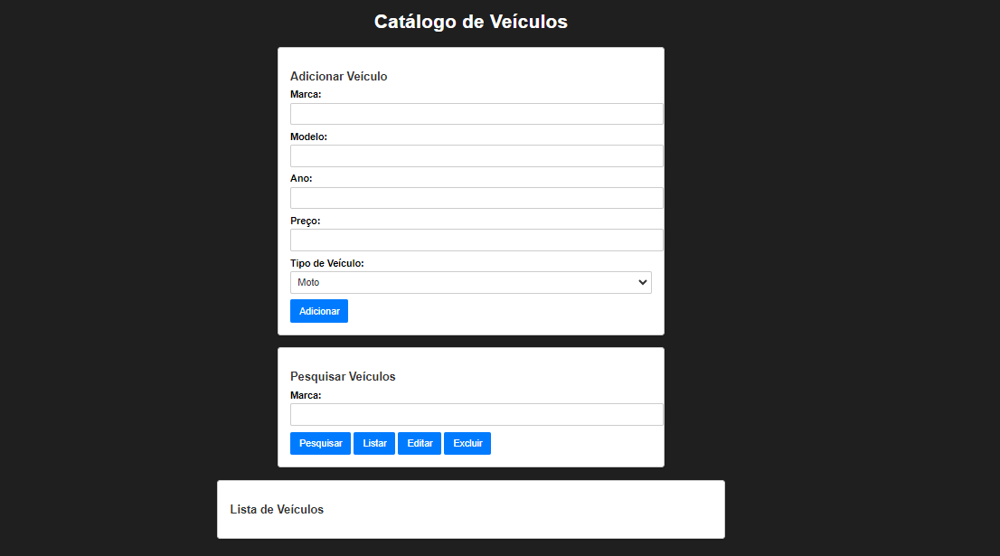

# Catálogo de Veículos
Este é um projeto de catálogo de veículos em JavaScript. Ele permite que você adicione, pesquise, edite e exclua informações sobre veículos, incluindo carros e motos. O catálogo também mantém o controle da quantidade total de veículos no sistema.

## Funcionalidades
Adicionar novos veículos, especificando se são carros ou motos.
Pesquisar veículos por marca.
Editar o preço de um veículo existente.
Excluir veículos por marca.
Listar todos os veículos no catálogo.

## Observação:
Para um bom funcionamente do projeto é necessário executar via live server ou executar via Node.js o ambiente de execução JavaScript, caso for executar via Node.js segue os pré requisitos:

## Pré-requisitos
Certifique-se de ter o seguinte instalado antes de executar o projeto:

Node.js - O ambiente de execução JavaScript.
NPM ou Yarn - Gerenciador de pacotes JavaScript.
## Como Usar
1  Clone este repositório para o seu computador:

git clone https://github.com/seu-usuario/nome-do-repositorio.git

2 Navegue até o diretório do projeto: 
cd nome-do-repositorio

3 Instale as dependências do projeto: 
npm install 
ou 
yarn install

4 Execute o projeto: 
npm start 
ou 
yarn start

5 Abra o aplicativo em seu navegador: 
http://localhost:3000

6 Agora você pode usar o catálogo de veículos para adicionar, pesquisar, editar e excluir veículos.

